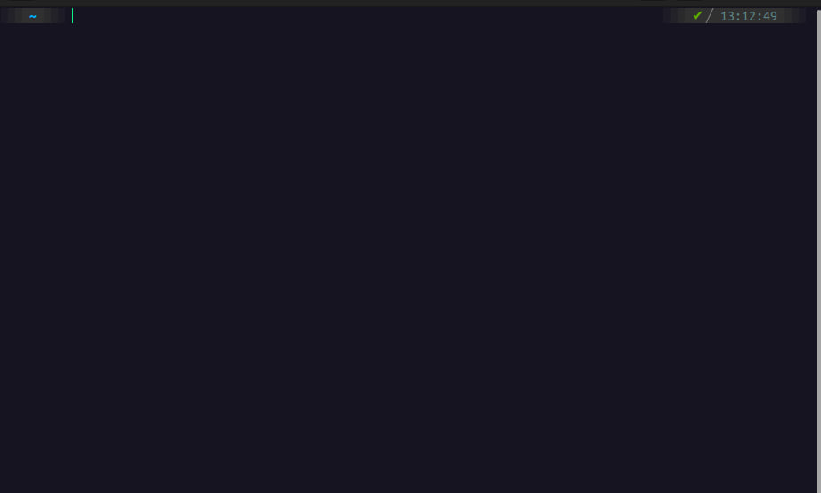

<h1 align="center">Инструкция по настройке кастомного терминала на операционной системе убунту</h1>

<h2>☝️ Выполняем следующие пункты:</h2>
  <ul>
<!--     <li>Solving rubik's cube 4x4.</li> -->
    <h3> ✅  sudo apt install zsh (для Debian‑подобных дистрибутивов, аля Ubuntu)</h3>
    <h3> ✅ На всякий случай проверяю корректность установки следующей командой:
            zsh --version</h3>
    <h3> ✅ Zsh не может автоматически сменить оболочку с Bash на Zsh, поэтому нужно выполнить следующую команду (потребуется ввести пароль пользователя) и перезапустить терминал: </h3>
        <strong>$ chsh -s $(which zsh)</strong>
<!--     <li>Solving rubik's cube 5x5!</a>.</li> -->
    <h3> ✅ Устанавливаем Oh my ZSH </h3>
    <strong>sh -c "$(curl -fsSL https://raw.githubusercontent.com/ohmyzsh/ohmyzsh/master/tools/install.sh)"</strong>
    <h3> ✅ Check out my <a href="/">CV</a>.</h3>
  </ul>

