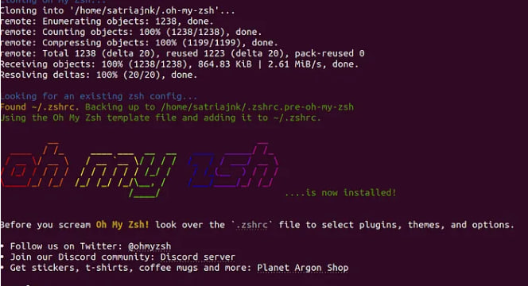
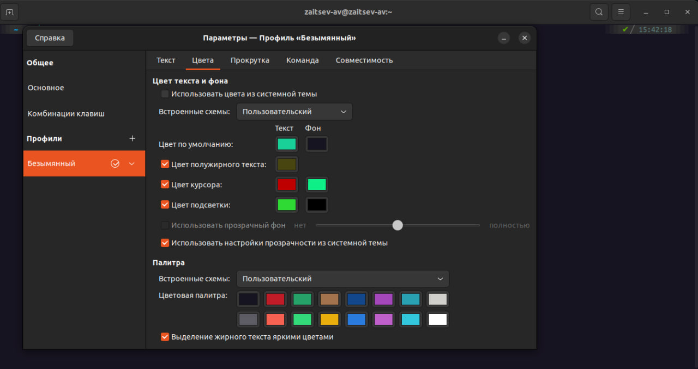

<h1 align="center">Настройка кастомного терминала в Ubuntu</h1>

    
        <h1>Следующие шаги помогут
    настроить кастомный терминал на основе Zsh и темы Powerlevel10k:</h1>
    <h2><b>🔺Установка Zsh:</b></h2>
    
<code>sudo apt install zsh</code> (для Debian-подобных дистрибутивов,таких как Ubuntu)

    
    <h2><b>🔸Проверка установки Zsh:</b></h2> 
<code>zsh --version</code>

    <h2><b>🔸Назначение Zsh в качестве оболочки по умолчанию:</b></h2>
    

    <code>chsh -s $(which zsh)</code>
    

    <h2><b>🔸Установка Oh My Zsh:</b></h2>
    <pre><code>sh -c "$(curl -fsSL https://raw.githubusercontent.com/ohmyzsh/ohmyzsh/master/tools/install.sh)"</code></pre>
    <h2><b>🔸Установка Powerlevel10k:</b></h2>
    <pre><code>git clone ‐depth=1 https://github.com/romkatv/powerlevel10k.git ${ZSH_CUSTOM:‐$HOME/.oh‐my‐zsh/custom}/themes/powerlevel10k</code></pre>
    <h2><b>🔸Настройка Powerlevel10k в качестве темы по умолчанию:</b></h2>
    <pre><code>$ sudo nano ~/.zshrc</code></pre>
    
Изменить <code>ZSH_THEME=»robbyrussell»</code> на <code>ZSH_THEME=»powerlevel10k/powerlevel10k»</code>
 <h3>
        <b>🔸Запуск настройки Powerlevel10k:</b></h3>
    <pre>
        <code>p10k configure</code></pre>
    <h2>🔺Установка плагинов</h2>
    
Сначала установим несколько дополнительных плагинов, которые не входят в Oh-My-Zsh.

    <h3>🟢 zsh-autosuggestions </h3>
    
 Добавляет автозаполнения для shell-команд. 

    <pre>
        <code> git clone https://github.com/zsh-users/zsh-autosuggestions ${ZSH_CUSTOM:-~/.oh-my-zsh/custom}/plugins/zsh-autosuggestions </code></pre>
    <h3>🟢 zsh-syntax-highlighting </h3>
    
 Подсветка синтаксиса в оболочке. 

     <pre>
         <code>git clone https://github.com/zsh-users/zsh-syntax-highlighting.git ${ZSH_CUSTOM:-~/.oh-my-zsh/custom}/plugins/zsh-syntax-highlighting </code></pre>
    
 Настройка цветовой схемы. 

    

